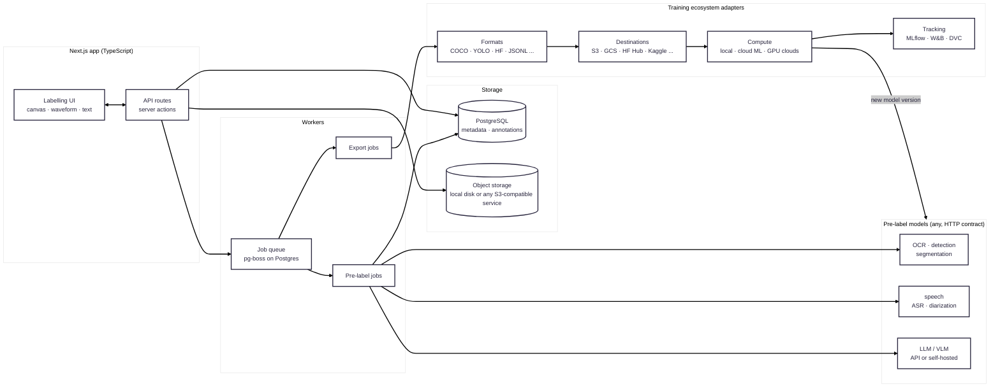
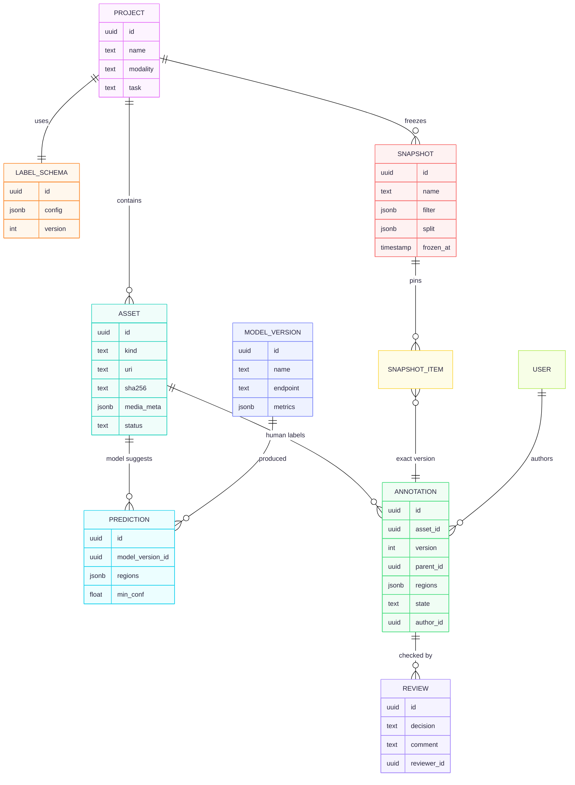
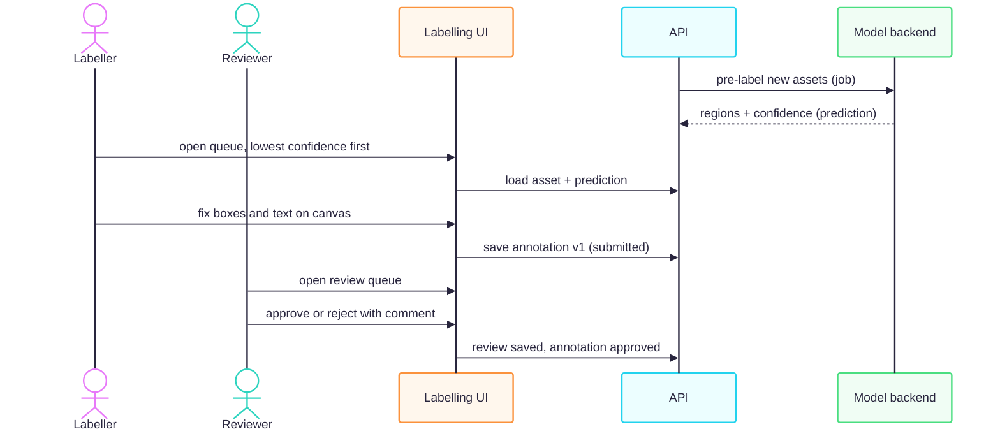
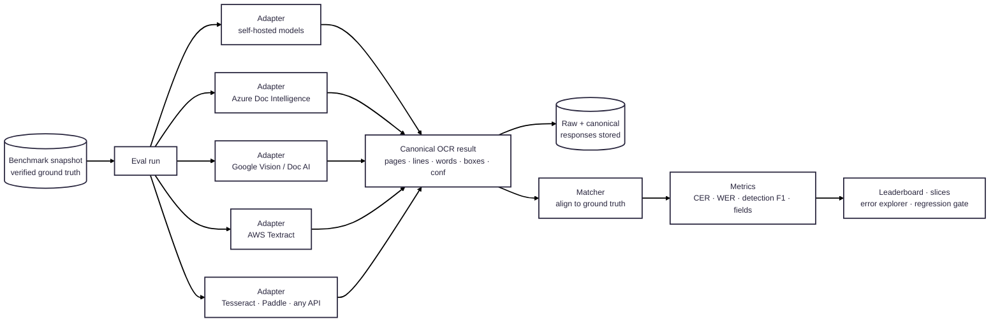
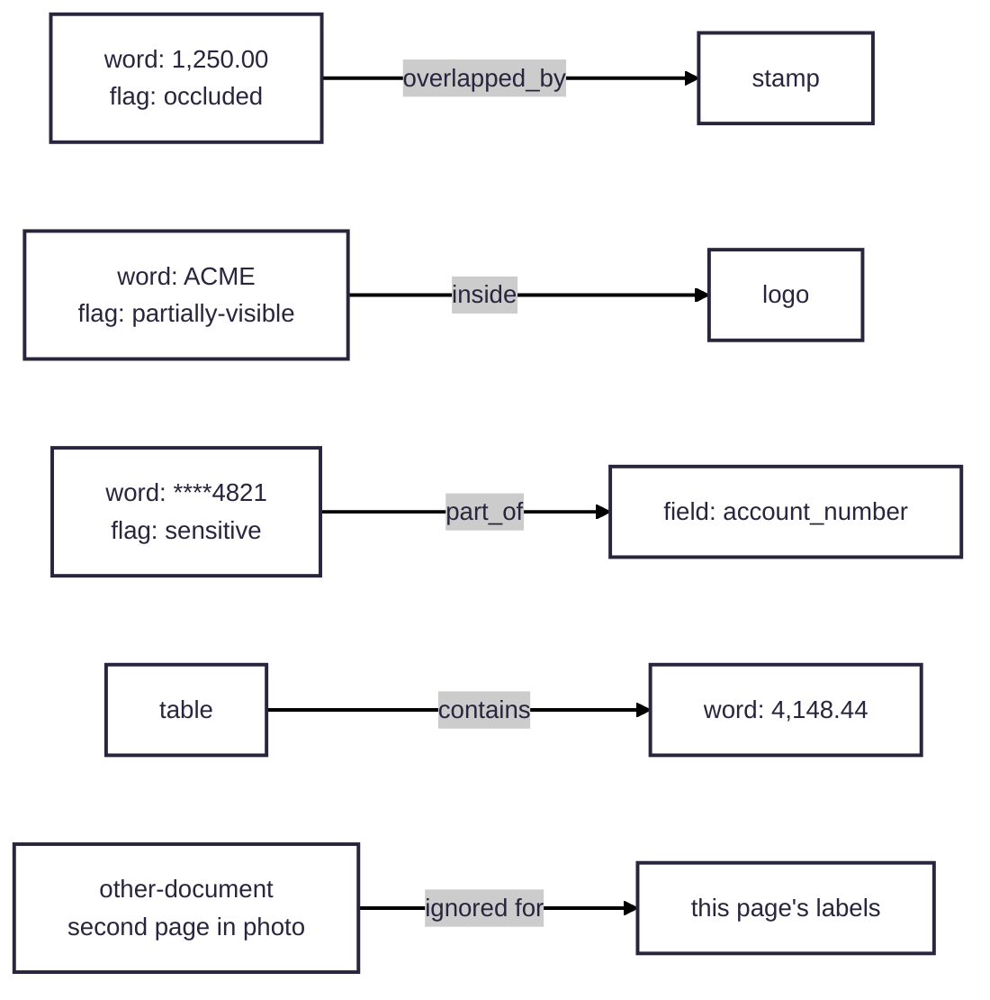

# OpenLabel — architecture

A web app for creating, labelling, reviewing, curating and exporting training datasets
for any modality and any modern training stack: vision, documents, video, audio, text,
LLM/generative data (SFT, preferences, evals) and multimodal. Models pre-label, people
correct, every change is versioned, and frozen dataset snapshots export in any common
format to any storage, launch on any compute, and log to any tracker.

## 1. Principles

1. **Label the original asset, never pre-cut pieces.** Regions (boxes, polygons, audio
   segments) are stored in the source's own coordinates. Training crops and clips are
   generated at export, deterministically. This removes the misaligned-crop bug class.
2. **Modality-agnostic core, modality plugins.** The core knows assets, regions,
   annotations, reviews and snapshots. Image/audio/text specifics live in plugins.
3. **Models suggest, humans decide.** Model output is stored as a _prediction_, never as
   ground truth. Only human-approved annotations reach a training snapshot.
4. **Nothing is overwritten.** Every edit creates a new annotation version with author and
   time. Snapshots pin exact versions, so any training run can be reproduced.
5. **Hard items first.** Queues sort by model confidence, so people spend time where the
   model is unsure.
6. **Training-stack agnostic.** The platform never assumes one framework, format, cloud
   or trainer. Formats, storage destinations, compute providers, trackers and pre-label
   models are all **adapters** behind fixed interfaces. Kaggle is one compute adapter
   among many.

## 2. System



## 3. Data model



**`regions` is the one flexible field (JSONB).** Its shape is set by the modality plugin and checked against the project's label schema:

| Modality        | Region shape                                           |
| --------------- | ------------------------------------------------------ |
| OCR image       | `{id, poly: [[x,y]...], text, line_id, conf?, flags?}` |
| Detection image | `{id, bbox: [x1,y1,x2,y2], class}`                     |
| Audio           | `{id, start_s, end_s, text, speaker?, lang?}`          |
| Text            | `{id, start, end, label}`                              |

Annotation `state`: `draft → submitted → approved | rejected`. Only `approved` versions can enter a snapshot.

## 4. Labelling flow



## 5. Modality plugins

Each plugin supplies the same four parts, so new modalities don't touch the core:

| Part                       | Image / OCR                                                                                           | Audio                                                                                 |
| -------------------------- | ----------------------------------------------------------------------------------------------------- | ------------------------------------------------------------------------------------- |
| **Editor** (React)         | `react-konva` canvas: zoom, pan, draw/move/resize boxes and polygons, inline text edit, line grouping | `wavesurfer.js` waveform + regions: play/loop segment, edit transcript, speed control |
| **Region validator** (zod) | polygon inside image, non-empty text                                                                  | `start < end`, within duration                                                        |
| **Pre-label adapter**      | calls any OCR backend's `POST /predict`                                                               | calls any ASR backend's `POST /predict`                                               |
| **Exporters**              | docTR recognition (crops + `labels.json`), docTR detection, COCO                                      | JSONL manifest (audio path, start, end, text), HF datasets                            |

**Model backend contract**, which any model can implement:

- Request: `POST /predict {asset_uri, task, params}`
- Response: `{model_version, regions: [...], min_conf}`

## 6. Labelling workspace (OCR)

```
┌──────────────────────────────────────────────┬──────────────────────────────┐
│ CANVAS (full original image)                 │ SELECTED BOX                 │
│                                              │ ┌──────────────────────────┐ │
│   ┌───────┐ ┌─────┐       ┌─────────┐        │ │ zoomed crop of the box   │ │
│   │ Total │ │ Due │       │  $40.00 │        │ │   $1O5.20                │ │
│   └───────┘ └─────┘       └─────────┘        │ └──────────────────────────┘ │
│   ┌───────┐ ┌─────┐       ┌─────────┐        │ Text:  [ $105.20        ]    │
│   │  Tax  │ │ (8%)│       │ $1O5.20 │  ◄──── │ Model: $1O5.20  conf 0.62    │
│   └───────┘ └─────┘       └─────────┘ red =  │ Line:  9   Flags: [ ] unclear│
│                                       low    │ [Enter] accept  [Tab] next   │
│  draw · move · resize · split · merge  conf  │ [N] new box  [Del] delete    │
├──────────────────────────────────────────────┼──────────────────────────────┤
│ zoom · pan · rotate page · pre-label model ▾ │ LINE VIEW: all lines as text,│
│ re-run OCR on selection                      │ click a line → selects boxes │
└──────────────────────────────────────────────┴──────────────────────────────┘
```

**Where the rectangles come from:**

- **Any OCR model behind the `/predict` contract**, chosen per project: self-hosted open-source engines (docTR, PaddleOCR, Tesseract, EasyOCR…) or cloud APIs (Azure, Google, AWS).
- **Pick by measurement:** the evaluation module (section 12) ranks engines on the project's own benchmark, so the default is whichever scores best on that project's documents.
- **Kept separately:** the OCR's boxes are stored as a _prediction_, and your edited boxes as the _annotation_, so we can later measure how much people had to fix.

**Editing:**

- **Rectangles:** drag to move, drag corners to resize, rotate for tilted text, draw a new box, delete, **split** one box into two words, or **merge** two boxes into one.
- **Re-read:** after you resize a box, "re-run OCR on selection" asks the model again for just that box. Usually the text then corrects itself, and you only confirm.
- **Character boxes (optional, per project):** a box can be split into per-character boxes for projects that need character-level labels.

- **Layout:** full image on a canvas with every word box drawn. Clicking a box opens its text beside it, with the crop zoomed in for checking.
- **Colour:** each box is coloured by confidence, so you can see at a glance what to check.
- **Keyboard:** Enter = correct, Tab = next box, type to fix, `N` = new box, Del = delete.
- **Whole page:** "Accept all above 0.95" with one key, so time goes only on uncertain words.
- **Bulk fixes:** rules such as "O → 0 inside numbers" across a project, recorded as edits with a reason.
- **Ownership:** each labeller gets their own batch of assets, so two people never edit the same page.

## 7. Snapshots and export

- **Freezing:** a snapshot freezes a filter (project, approved only, date range, tags) into a **fixed list of annotation versions**, and splits them into train/val/test by **asset**, never by region. That stops pages leaking between train and test.
- **Exporting:** writes files into object storage, then optionally pushes them to any configured destination (section 11.3).
- **Reproducibility:** a training run records the snapshot ID, so every model version can be traced to exactly the data it was trained on.

## 8. Technology choices

| Concern      | Choice                                                                           | Why                                                                                                                                                                                                                                                               |
| ------------ | -------------------------------------------------------------------------------- | ----------------------------------------------------------------------------------------------------------------------------------------------------------------------------------------------------------------------------------------------------------------- |
| App          | Next.js (App Router) + TypeScript                                                | One codebase for UI and API; React ecosystem for the editors                                                                                                                                                                                                      |
| Database     | **PostgreSQL** + Drizzle ORM                                                     | Relations and transactions for the review workflow; JSONB covers flexible region shapes; many labellers at once. SQLite allowed only for single-user local use. MongoDB rejected: the core data is relational (asset → annotation versions → reviews → snapshots) |
| Files        | Storage adapter: local disk or any S3-compatible service (SeaweedFS bundled)     | Large media never in the DB; images stored by content hash so duplicates aren't saved twice                                                                                                                                                                       |
| Jobs         | pg-boss (queue inside Postgres)                                                  | No Redis to run; jobs are part of DB transactions                                                                                                                                                                                                                 |
| Image editor | react-konva                                                                      | Canvas performance with thousands of boxes; transform handles                                                                                                                                                                                                     |
| Audio editor | wavesurfer.js + regions plugin                                                   | Standard waveform editing                                                                                                                                                                                                                                         |
| Validation   | zod, shared between client and server                                            | One definition of each region shape                                                                                                                                                                                                                               |
| Auth         | Better Auth (email, OAuth/OIDC, TOTP 2FA, organisations)                         | Self-hosted, covers SSO + MFA + multi-tenant in one library                                                                                                                                                                                                       |
| Permissions  | Role + per-project policy checks in one module, enforced in API and DB queries   | One place to audit who can do what                                                                                                                                                                                                                                |
| UI kit       | shadcn/ui + Tailwind                                                             | Accessible components, consistent look                                                                                                                                                                                                                            |
| i18n         | next-intl                                                                        | Server and client translations, locale formatting                                                                                                                                                                                                                 |
| API docs     | OpenAPI generated from zod schemas                                               | Docs and SDKs never drift from the code                                                                                                                                                                                                                           |
| Deploy       | Docker Compose: app, Postgres, S3-compatible storage (SeaweedFS), model backends | Same setup locally and on a server                                                                                                                                                                                                                                |

## 9. Build vs adopt

**Label Studio** (open source) already covers multi-modality labelling with model pre-labelling, and **CVAT** covers images and video.

**Building our own is justified because:**

- a single open, adapter-based path from labelling to any training stack and any OCR evaluation;
- word-level OCR editing tuned for speed;
- versioned snapshots tied to model versions.

**Revisit this decision if** the custom editors take longer than about 4 weeks to reach parity on the basics.

## 10. Enterprise feature set

Releases: **R1** = first production release, **R2** = next, **R3** = later.

### 10.1 Label taxonomy: definitions, descriptions, versions

A project's labels are a **versioned taxonomy**, not a free-text list.

| Feature                | Detail                                                                                                                             | Release |
| ---------------------- | ---------------------------------------------------------------------------------------------------------------------------------- | ------- |
| Label definition       | `key` (stable ID), display name, **description**, colour, keyboard shortcut, allowed region type (box / polygon / span / segment)  | R1      |
| Guidelines per label   | Rich-text instructions + **example images/audio** ("label this as X", "not as Y"), shown in the editor when the label is picked    | R1      |
| Hierarchy              | Parent/child labels (e.g. `amount` → `amount.subtotal`, `amount.total`)                                                            | R2      |
| Attributes             | Extra fields per label: enum, number, text, boolean (e.g. `handwritten: yes/no`, `language: hi/en`, `legible: yes/no`)             | R1      |
| Validation rules       | Regex / allowed character set per label (e.g. amount = `^\$?\d+(\.\d{2})?$`, a tax-ID or IBAN pattern); warns the labeller on save | R2      |
| **Taxonomy versions**  | Every change creates `v1, v2, …` with a changelog. Annotations record the version they were made under                             | R1      |
| Migrations             | Rename / merge / split a label with an automatic mapping, so old annotations move to the new version without rework                | R2      |
| Deprecation            | Retire a label without deleting history; the editor stops offering it                                                              | R1      |
| Import/export taxonomy | JSON/YAML, so one taxonomy can be shared across projects                                                                           | R2      |

### 10.2 Versioning everywhere

| What                 | How                                                                                                               |
| -------------------- | ----------------------------------------------------------------------------------------------------------------- |
| Annotations          | Append-only versions with author, time and diff; side-by-side compare of any two versions; restore an old version |
| Taxonomy             | Versioned as above                                                                                                |
| Assets               | Content-hashed; replacing a file makes a new asset version, and old annotations stay linked to the old one        |
| Snapshots (datasets) | Immutable; `dataset v3` = exact list of annotation versions + taxonomy version + split                            |
| Models               | Registry: model version → snapshot it was trained on → benchmark scores                                           |

The result is **full lineage**: for any prediction in production you can trace model → training snapshot → each annotation → who labelled it → which guideline version they followed.

### 10.3 Languages

Two separate meanings, both supported:

|                         | Detail                                                                                                                                                    | Release                       |
| ----------------------- | --------------------------------------------------------------------------------------------------------------------------------------------------------- | ----------------------------- |
| **UI languages (i18n)** | `next-intl`; English first, then Hindi, Telugu, Tamil, Kannada…; all text in translation files; dates/numbers formatted by locale                         | R1 framework, R2 translations |
| **Data languages**      | Per project and per region: `language` attribute (ISO 639 codes, e.g. `hi`, `te`, `en`), script (Latin, Devanagari, Telugu…), RTL support for Urdu/Arabic | R1                            |
| Character sets          | A project declares its allowed characters (e.g. docTR `devanagari`); the editor flags characters outside it                                               | R2                            |
| Input help              | On-screen keyboards / transliteration for Indic scripts, so labellers can type them                                                                       | R2                            |
| Fonts                   | Noto font family loaded for every supported script, so all text displays correctly                                                                        | R1                            |

### 10.4 Users, login and access

| Feature       | Detail                                                                                                 | Release                    |
| ------------- | ------------------------------------------------------------------------------------------------------ | -------------------------- |
| Login         | Email + password (hashed with argon2), **SSO via OIDC/SAML** (Google Workspace, Microsoft Entra, Okta) | R1 email + Google, R2 SAML |
| MFA           | TOTP authenticator apps; required for admins                                                           | R1                         |
| Organisations | Multi-tenant: org → teams → projects; each org's data strictly separated                               | R1                         |
| Roles (RBAC)  | Owner, Admin, Project Manager, Labeller, Reviewer, Viewer, API client; per-project overrides           | R1                         |
| Invitations   | Email invite with role; SCIM user sync from the identity provider                                      | R1 invite, R3 SCIM         |
| Sessions      | Revocable sessions, idle timeout, device list                                                          | R1                         |
| Labeller pool | Mark users as internal/external; restrict external labellers to assigned tasks only                    | R2                         |

### 10.5 Settings

| Level        | Examples                                                                                                                                                                              |
| ------------ | ------------------------------------------------------------------------------------------------------------------------------------------------------------------------------------- |
| Organisation | Branding, SSO config, password policy, data retention, allowed model backends, storage location (region), API keys                                                                    |
| Project      | Modality, taxonomy, guidelines, pre-label model + confidence threshold, review policy (none / 1 reviewer / 2-of-3 consensus), sampling rate for QA, export formats, auto-accept rules |
| User         | Language, theme (light/dark), keyboard shortcuts, notification preferences, default zoom                                                                                              |

### 10.6 Work management and progress

| Feature                 | Detail                                                                                                     | Release             |
| ----------------------- | ---------------------------------------------------------------------------------------------------------- | ------------------- |
| Task assignment         | Batches assigned to people, or a "next item" queue with locking so two people never get the same asset     | R1                  |
| Priority queues         | Lowest model confidence first; or by deadline, or by tag                                                   | R1                  |
| **Progress dashboards** | Per project: total / pre-labelled / in progress / submitted / approved / rejected, with burndown over time | R1                  |
| Per-person stats        | Items per hour, time per item, rejection rate, accuracy vs reviewers                                       | R1                  |
| Deadlines & SLAs        | Batch due dates, alerts when a batch is behind                                                             | R2                  |
| Notifications           | In-app + email: assigned work, review rejected, comments, @mentions                                        | R1 in-app, R2 email |
| Comments                | Threaded comments on an asset or a single region, with @mentions                                           | R1                  |

### 10.7 Quality control

| Feature                  | Detail                                                                                                            | Release |
| ------------------------ | ----------------------------------------------------------------------------------------------------------------- | ------- |
| Review workflow          | Approve / reject with reason; configurable stages (label → review → final QA)                                     | R1      |
| **Gold set / honeypots** | Assets with known answers mixed into queues to score labellers automatically                                      | R2      |
| Consensus                | Same asset labelled by N people; agreement score; disagreements sent to review                                    | R2      |
| Agreement metrics        | Character error rate, word error rate, box IoU, Cohen's kappa for classes                                         | R2      |
| Model-vs-human diff      | How much people changed the model's prediction, per label and per model version, to see what the model gets wrong | R1      |
| Auto-checks              | Rules on save: empty text, box outside image, text not matching the label's pattern, overlapping duplicate boxes  | R1      |

### 10.8 Models and active learning

| Feature            | Detail                                                                                                                | Release |
| ------------------ | --------------------------------------------------------------------------------------------------------------------- | ------- |
| Model registry     | Each model version: endpoint, framework, training snapshot, benchmark scores, status (staging / production / retired) | R1      |
| Pre-label backends | Any HTTP endpoint meeting the `/predict` contract; several per project, choose per batch                              | R1      |
| Training jobs      | Launch training on any compute adapter (section 11.4) from a snapshot; track status; register the result              | R2      |
| Benchmark gate     | New model must beat the current one on the project's test snapshot before it can be used for pre-labelling            | R2      |
| Active learning    | Pick the next assets to label by model uncertainty, so each hour of labelling helps the model most                    | R3      |

### 10.9 APIs and integrations

| Feature       | Detail                                                                                                                 | Release              |
| ------------- | ---------------------------------------------------------------------------------------------------------------------- | -------------------- |
| REST API      | Versioned (`/api/v1`), **OpenAPI spec** generated from zod schemas, so docs and client SDKs are produced automatically | R1                   |
| API keys      | Scoped per org/project with permissions and expiry; shown once, stored hashed                                          | R1                   |
| SDKs          | Python + TypeScript clients generated from the OpenAPI spec                                                            | R2                   |
| Webhooks      | Events: `asset.created`, `annotation.approved`, `snapshot.frozen`, `model.registered`; signed (HMAC) with retries      | R2                   |
| Bulk import   | Upload ZIP / folder / S3 prefix; import existing labels (COCO, docTR, YOLO, JSONL, PageXML)                            | R1                   |
| Exports       | Any exporter from section 11.2, to any destination from section 11.3                                                   | R1 core set, R2 rest |
| Rate limiting | Per key and per IP                                                                                                     | R1                   |

### 10.10 Security, compliance and audit

| Feature        | Detail                                                                                                              | Release |
| -------------- | ------------------------------------------------------------------------------------------------------------------- | ------- |
| **Audit log**  | Append-only record of every action (who, what, when, from where), exportable                                        | R1      |
| Encryption     | TLS everywhere; storage encrypted at rest; signed short-lived URLs for media                                        | R1      |
| PII handling   | Mark assets/regions as sensitive; mask on screen for roles without access (e.g. account numbers, ID numbers, faces) | R2      |
| Data retention | Auto-delete or archive by policy; hard delete on request                                                            | R2      |
| Backups        | Nightly Postgres backups + object storage versioning; tested restore                                                | R1      |
| Secrets        | Environment / secret manager only, never in the DB or code                                                          | R1      |

### 10.11 Operations

| Feature        | Detail                                                                      | Release             |
| -------------- | --------------------------------------------------------------------------- | ------------------- |
| Deploy         | Docker Compose for single server; Helm chart for Kubernetes                 | R1 Compose, R3 Helm |
| Observability  | Structured logs, Prometheus metrics, OpenTelemetry traces, health endpoints | R1                  |
| Error tracking | Sentry                                                                      | R1                  |
| Feature flags  | Turn features on per org                                                    | R2                  |
| Search         | Postgres full-text search across label text and comments                    | R1                  |
| Large media    | Image tiling for very large scans; streaming audio                          | R2                  |
| Testing        | Unit + API tests; Playwright end-to-end tests for the editors               | R1                  |

## 11. Coverage of the training world

### 11.1 Data types and tasks

Every row is a modality plugin (editor + region schema + validators + exporters) on the same core.

| Area                      | Tasks the editor supports                                                                                                                                                                                                               |
| ------------------------- | --------------------------------------------------------------------------------------------------------------------------------------------------------------------------------------------------------------------------------------- |
| **Images**                | Classification (single/multi-label), bounding boxes, rotated boxes, polygons, masks (brush + model-assisted), keypoints/pose, captioning, visual QA                                                                                     |
| **Documents**             | OCR words/lines, layout regions (table, header, signature, stamp), key-value extraction, table structure, reading order, handwriting flags                                                                                              |
| **Video**                 | Frame and clip classification, object tracking across frames, temporal events/segments                                                                                                                                                  |
| **Audio / speech**        | Transcription, speaker diarization, segment classification (sound events), emotion, language ID, TTS script–recording alignment, quality rating                                                                                         |
| **Text / NLP**            | Classification, NER spans, relations, sentiment, intent, translation pairs, summarisation targets                                                                                                                                       |
| **LLM / generative**      | Instruction→response (SFT), multi-turn chats, **preference pairs** (chosen/rejected) and rankings, rubric scoring, red-teaming, tool-use / agent traces, RAG grounding (answer + supporting passages), eval sets with reference answers |
| **Multimodal**            | Image–text pairs, document VQA, audio–text alignment, VLM instruction data                                                                                                                                                              |
| **Tabular / time series** | Row/series labels, anomaly windows, event marking                                                                                                                                                                                       |
| **3D / point cloud**      | (R3) cuboids, segmentation                                                                                                                                                                                                              |

### 11.2 Export formats (adapters)

| Area            | Formats                                                                                                                                                                                               |
| --------------- | ----------------------------------------------------------------------------------------------------------------------------------------------------------------------------------------------------- |
| Vision          | COCO, YOLO (detect/seg/pose), Pascal VOC, LabelMe, Cityscapes masks, ImageNet-style folders                                                                                                           |
| Documents / OCR | docTR (recognition + detection), PaddleOCR, PageXML, ALTO, hOCR, FUNSD/CORD-style KIE                                                                                                                 |
| Video           | MOT, CVAT XML                                                                                                                                                                                         |
| Speech          | JSONL manifests (NeMo/ESPnet-style), Kaldi, Hugging Face audio datasets, CSV + clips                                                                                                                  |
| NLP             | CoNLL, spaCy, JSONL spans                                                                                                                                                                             |
| **LLM**         | Chat JSONL (`messages` with roles), Alpaca, ShareGPT, preference/DPO JSONL (`prompt`, `chosen`, `rejected`), reward-model ranking, eval JSONL; provider-specific variants for hosted fine-tuning APIs |
| Universal       | **Hugging Face Datasets / Parquet**, WebDataset (tar shards for large-scale training), TFRecord, CSV/JSONL                                                                                            |

New formats are added as one exporter class plus tests. **Each exporter validates its own output** (schema check, then a sample loaded with the target library) before marking a snapshot export as good.

### 11.3 Destinations

Local disk, **S3 / GCS / Azure Blob**, **Hugging Face Hub** (private datasets), Kaggle datasets, W&B Artifacts, MLflow datasets, DVC and lakeFS remotes, Databricks/Delta tables. Each export records its destination URI and checksum on the snapshot.

### 11.4 Compute (training launchers)

| Kind                        | Adapters                                                                       |
| --------------------------- | ------------------------------------------------------------------------------ |
| Local / on-prem             | Local GPU, SSH host, Docker, Kubernetes jobs, Ray, Slurm                       |
| Notebook GPUs               | Kaggle, Colab                                                                  |
| GPU clouds                  | RunPod, Lambda, Modal, Vast.ai; SkyPilot to run on whichever cloud is cheapest |
| Managed ML platforms        | AWS SageMaker, Google Vertex AI, Azure ML, Databricks                          |
| **Hosted fine-tuning APIs** | LLM providers' fine-tuning endpoints that accept chat/preference JSONL         |

Every launcher implements one interface: `submit(snapshot, recipe) → job`, plus `status(job)`, `logs(job)` and `artifacts(job)`.

**Recipes** are versioned training configs that the platform passes through unchanged:

- Hugging Face Trainer / TRL (SFT, DPO, GRPO)
- Axolotl / Unsloth (LLM fine-tuning)
- Ultralytics (YOLO)
- docTR references
- NeMo (speech)
- or any script.

### 11.5 Experiment tracking and lineage

- **Tracking:** MLflow and Weights & Biases adapters log the run with the **snapshot ID, label-set version and recipe**.
- **Results flow back:** metrics and the trained model return to the platform's model registry.
- **One lineage graph:** data → labels → snapshot → run → model → benchmark → deployment.

### 11.6 Model-assisted labelling (any model)

| Model kind                                                    | Used for                                                                                        |
| ------------------------------------------------------------- | ----------------------------------------------------------------------------------------------- |
| Task models (OCR, YOLO/DETR, Whisper, NER)                    | First-pass labels to correct                                                                    |
| **Segment Anything–style models**                             | Click a point → mask, for fast segmentation                                                     |
| Open-vocabulary detectors                                     | Boxes from a text prompt ("signature", "stamp")                                                 |
| **LLMs / VLMs** (hosted API or self-hosted via vLLM / Ollama) | Draft labels, LLM-as-judge pre-scoring, synthetic data generation, guideline consistency checks |
| Embedding models                                              | Similarity search, duplicate detection, clustering to find gaps                                 |

**Model output is always a prediction and never ground truth.** Every prediction records which model, version and prompt produced it.

### 11.7 Data curation

- **Deduplication:** exact (hash), near (perceptual hash), semantic (embeddings).
- **Embedding explorer:** cluster view to spot unlabelled regions of the data, outliers and label errors.
- **Slices:** saved filters such as "handwritten + Telugu + low confidence"; training sets can be built from slices.
- **Dataset health:** class balance, label distribution per split, train/test leakage check, missing-label report.
- **Label-error detection:** confident-learning methods flag annotations the model strongly disagrees with, sent for re-review.

## 12. Evaluation: gauging accuracy of any model

The verified annotations are a **benchmark**. Any model for any task type — classifier, object detector, OCR engine, speech recogniser, NER tagger, LLM — can be run against a frozen benchmark snapshot, its response converted to the task's canonical prediction by an adapter, and scored with that task's standard metrics. The core (benchmarks, runs, leaderboard, slices, error explorer, regression gate) is task-agnostic; each task type plugin supplies its prediction contract, matcher and metrics ([ADR-0004](adr/0004-task-types-for-labelling-and-evaluation.md)).

| Task type        | Matcher                                    | Metrics                                                            |
| ---------------- | ------------------------------------------ | ------------------------------------------------------------------ |
| Classification   | per item                                   | accuracy, macro/micro P/R/F1, confusion matrix, top-k, calibration |
| Object detection | Hungarian on box IoU per class             | mAP@0.5, mAP@0.5:0.95 (COCO protocol), per-class AP                |
| Segmentation     | mask overlap                               | mean IoU, Dice, boundary F1                                        |
| OCR              | §12.2 below                                | §12.3 below                                                        |
| Speech-to-text   | time-aligned segments, then word alignment | WER, CER, S/D/I counts, diarization error rate                     |
| NER / spans      | span overlap                               | entity P/R/F1, strict and partial                                  |
| LLM / generative | per prompt                                 | reference match, rubric scores, judge–human agreement, win rate    |

OCR is the most detailed plugin and is described in full below as the worked example.



### 12.1 Canonical OCR result (the contract)

Every engine's output is converted into this one schema before scoring. It's the same shape as the annotations, so ground truth and predictions compare directly.

```json
{
  "engine": "azure-di", "engine_version": "prebuilt-read@2024-11-30",
  "asset_id": "…", "page": 1,
  "width": 2508, "height": 3550, "unit": "px",
  "rotation_applied": 0,
  "lines": [
    { "id": "l1", "text": "Invoice No: INV-2024-00187",
      "poly": [[x,y],[x,y],[x,y],[x,y]], "conf": 0.98,
      "words": [ { "id": "w1", "text": "Invoice", "poly": [[x,y],…], "conf": 0.99 } ] }
  ],
  "fields": { "invoice_no": { "value": "INV-2024-00187", "conf": 0.97, "word_ids": ["w3"] } },
  "meta": { "latency_ms": 840, "cost_usd": 0.0015, "raw_ref": "s3://…/raw.json" }
}
```

**Rules every adapter must follow** (enforced by a contract test suite each adapter has to pass):

| Concern      | Rule                                                                                                                                                                                                                       |
| ------------ | -------------------------------------------------------------------------------------------------------------------------------------------------------------------------------------------------------------------------- |
| Coordinates  | Always pixels of the original asset at page level. Adapters convert from the engine's convention: Textract returns 0–1 fractions, Azure uses inches for PDFs, some engines return coordinates of a rotated or resized page |
| Rotation     | If the engine rotated the page, the adapter maps boxes back to the original orientation and records `rotation_applied`                                                                                                     |
| Confidence   | Scaled to 0–1 (Textract and Tesseract report 0–100). Missing confidence = `null`, never a made-up value                                                                                                                    |
| Hierarchy    | Words always present. Lines present if the engine gives them; otherwise the platform's grouper builds them, flagged `lines_source: "derived"`                                                                              |
| Text         | Unicode NFC, original casing and punctuation kept; any normalisation happens only in scoring, never in the adapter                                                                                                         |
| Raw response | Always stored next to the canonical one, so adapters can be fixed and re-run later without paying for the API again                                                                                                        |
| Errors       | Timeouts, rate limits and failures recorded per asset; a failed asset scores as an empty result and is counted, not skipped                                                                                                |

**Adapter interface** (Python or TypeScript, run as a worker):

```
run(asset_bytes, params) -> raw_response          # calls the engine / API
to_canonical(raw_response, asset_meta) -> CanonicalOCR
describe() -> {engine, version, supports: [words, lines, fields, handwriting, languages]}
```

**Two ways to add an engine:**

- **A built-in adapter:** docTR, Tesseract, PaddleOCR, RapidOCR, EasyOCR, Azure Document Intelligence, Google Vision / Document AI, AWS Textract, Mistral OCR, and LLM/VLM "read this page" prompts.
- **A declarative mapping for any other JSON API:** you give the endpoint, auth, and a JSONPath/JSONata mapping from their response to the canonical fields. No code needed for simple APIs.

### 12.2 Matching predictions to ground truth

Scoring an OCR system means first deciding which predicted word corresponds to which true word. Counting matching words alone ignores position and lets errors cancel out.

1. **Spatial match:** pair predicted and true words by box overlap (IoU ≥ threshold, default 0.5), using one-to-one Hungarian assignment. Words split or merged differently are handled by a second pass that matches one true word to several predicted words, or the reverse, when their union overlaps well.
2. **Text comparison** on each matched pair, after the project's normalisation profile.
3. **Order-aware fallback** for engines with poor or missing boxes: align the full page text by reading order (edit-distance alignment), so text-only engines (some VLMs) can still be scored, labelled "text-only".

**Normalisation profiles** are versioned and chosen per benchmark: none (strict), case-insensitive, whitespace-collapsed, punctuation-ignored, Unicode-folded, and **domain rules** (e.g. O/0 kept distinct for amounts). Every report shows which profile was used.

### 12.3 Metrics

| Level                  | Metrics                                                                                                                                      |
| ---------------------- | -------------------------------------------------------------------------------------------------------------------------------------------- |
| **Characters**         | Character Error Rate (CER) = (substitutions + deletions + insertions) / true characters; per-character confusion matrix (e.g. O→0, 1→I, 5→S) |
| **Words**              | Word Error Rate (WER), exact word accuracy, near-miss rate (1 character off)                                                                 |
| **Detection**          | Box precision, recall and F1 at IoU 0.5 / 0.75; missed words; extra (hallucinated) words; split and merge counts                             |
| **End-to-end**         | A word counts only if both the box and the text are right; F1 at IoU 0.5                                                                     |
| **Lines and order**    | Line-level CER; reading-order correctness (Kendall's tau over matched words)                                                                 |
| **Fields** (key-value) | Per-field exact match and CER (invoice number, tax ID, amounts, dates); document-level "all critical fields right" rate                      |
| **Confidence quality** | Calibration: is 0.9 confidence right 90% of the time? Accuracy kept vs. % of words auto-accepted at each confidence threshold                |
| **Operational**        | Latency p50/p95, throughput, cost per 1,000 pages, failure rate                                                                              |

Every metric comes with a **confidence interval** (bootstrap over pages), so small differences between engines aren't over-read.

### 12.4 Reports

- **Leaderboard** per benchmark: engines × metrics, with cost and latency side by side.
- **Slices:** the same metrics broken down by any tag or attribute (document type, language, script, handwritten vs printed, scan vs photo, rotation, image quality). This shows _where_ each engine fails.
- **Error explorer:** click any metric to see the actual mistakes on the canvas, with ground truth and prediction overlaid. Filter by error type (substitution, missed word, split, wrong box).
- **Head-to-head:** compare two engines or two model versions word by word, showing what one gets right that the other doesn't.
- **Trends:** the same benchmark scored over time as models change.
- **Export:** PDF/CSV reports and an API endpoint for CI.

### 12.5 Using evaluation in practice

| Use                   | How                                                                                                                                       |
| --------------------- | ----------------------------------------------------------------------------------------------------------------------------------------- |
| Choose a vendor       | Run all APIs on your own benchmark; compare accuracy, cost per 1,000 pages and latency on _your_ documents                                |
| Regression gate       | A new model version must not get worse on any protected slice before it can be used for pre-labelling or deployed (CI calls the eval API) |
| Production monitoring | Sample live traffic, have people label it, score it continuously; alert when accuracy drifts                                              |
| Routing               | Slice results show which engine wins per document type; the OCR server can then route each type to its best engine                        |
| Labelling ROI         | Model-vs-human diffs from the labelling workflow feed the same metrics, so every labelled page also measures the current model            |

### 12.6 Data model additions

`BENCHMARK` (a frozen snapshot marked for evaluation, with its normalisation profile) → `EVAL_RUN` (benchmark × engine adapter × engine version × params) → `EVAL_RESULT` (raw + canonical response per asset) → `EVAL_METRIC` (metric, slice, value, confidence interval). `ENGINE` records adapter type, endpoint, version and cost model. Runs are immutable and reproducible from the stored raw responses.

## 12.7 Scaling

One server cannot run models over large datasets while serving the UI, so the system is split into tiers that scale independently ([ADR-0005](adr/0005-scaling.md)):

- **Web/API:** stateless replicas behind a load balancer; never runs a model.
- **Workers:** stateless replicas; chunked, idempotent, resumable jobs; per-engine rate limits and cost caps.
- **Inference servers:** separate CPU/GPU pools per model behind the `/predict` contract (Triton, vLLM, TorchServe, BentoML or a paid API), autoscaled on queue depth.
- **Postgres:** vertical, then read replicas; prediction and eval-result tables partitioned.
- **Object storage:** all media and raw responses, accessed by signed URLs.

Deployment ladder: single machine (Compose) → Compose + remote GPU inference → Kubernetes (Helm, KEDA autoscaling).

## 13. Non-text content, overlaps and image conditions

Real images are not clean text: logos, stamps printed over words, signatures, QR codes,
watermarks, glare, a finger over the corner, a second document in the same photo. These must
be **labelled explicitly**, because they decide what is used for training, what is
scored in evaluation, and why a model fails.

### 13.1 Three label layers

| Layer                        | Applies to           | Examples                                                                                                                                                                                                      |
| ---------------------------- | -------------------- | ------------------------------------------------------------------------------------------------------------------------------------------------------------------------------------------------------------- |
| **Image tags** (whole asset) | The image as a whole | `photo` / `scan` / `digital-pdf`, `blurred`, `glare`, `low-light`, `skewed`, `rotated-90`, `cropped-edge`, `multiple-documents`, `background-clutter`, `fold-or-crease`, `thermal-faded`, `duplicate-of:<id>` |
| **Non-text regions**         | An area of the image | `logo`, `stamp/seal`, `signature`, `handwriting-block`, `qr-code`, `barcode`, `photo/face`, `chip` (smart cards), `watermark`, `hologram`, `table`, `figure`, `occluder` (finger, object), `other-document`   |
| **Text-region flags**        | A word or line box   | `occluded` (partly covered), `overlapped-by:<region_id>`, `partially-visible` (cut by image edge), `illegible`, `handwritten`, `strikethrough`, `low-contrast`, `vertical-text`, `sensitive` (PII)            |

All three come from the project's **taxonomy** (section 10.1), so each has a description, guidelines with example images, and versions. A project can switch off what it doesn't need.

### 13.2 Overlaps and relations



- **Relations** are stored on regions: `overlapped_by`, `occluded_by`, `inside`, `contains`, `part_of`, `same_as` (the same text repeated). These are what make an overlap explicit rather than guessed.
- **Overlap is computed automatically** when boxes intersect, and the editor asks the labeller to confirm the relation, e.g. "stamp covers 40% of this word: mark as occluded?"
- **Layers / z-order:** each region has a layer (background, document, overlay), so a stamp sits _above_ the words it covers.

### 13.3 Ignore regions ("don't care")

Some areas must be excluded from both training and scoring, otherwise models are punished or rewarded unfairly.

| Region                                            | Training                                                                                      | Evaluation                                                                                 |
| ------------------------------------------------- | --------------------------------------------------------------------------------------------- | ------------------------------------------------------------------------------------------ |
| `illegible` text                                  | Not used as a recognition label (no guessing); still used for the detector as "text is here"  | Excluded: an engine is neither rewarded nor penalised for it                               |
| Masked / redacted (`****4821`, blacked-out PII)   | Configurable: learn to read the mask characters, or skip                                      | Scored only if the project says so                                                         |
| `other-document` (a second document in the photo) | Excluded from this asset's labels, or split into its own asset                                | Excluded: words found there are neither hits nor false positives                           |
| `logo`, `watermark`, `hologram` with text inside  | Per project: either read the text or treat as non-text                                        | Matches the project's choice, so engines aren't punished for reading or skipping logo text |
| `occluder` (finger, object)                       | Words underneath flagged `occluded`; crops not used for recognition when coverage > threshold | Occluded words reported separately, not mixed into the main score                          |

This follows the "don't care" convention used in standard OCR benchmarks (ICDAR's `###`), so our scores are comparable to published ones.

### 13.4 How each feature uses them

| Feature                 | Use                                                                                                                                                                                                                                                                                    |
| ----------------------- | -------------------------------------------------------------------------------------------------------------------------------------------------------------------------------------------------------------------------------------------------------------------------------------- |
| **Pre-labelling**       | A layout / object detector proposes logos, stamps, signatures, QR codes and tables; an image-quality model proposes tags (blur, glare, rotation); OCR boxes inside a detected logo or stamp are pre-flagged                                                                            |
| **Editor**              | **Layers panel**: show/hide/lock each class (hide stamps to see the words beneath); click-cycling to pick between stacked boxes; a polygon or brush tool for irregular stamps and signatures; occlusion % shown live                                                                   |
| **Auto-checks on save** | Word overlapping a stamp but not flagged; illegible word with text typed in; box crossing an `other-document` boundary; logo text policy not followed                                                                                                                                  |
| **Training export**     | Recognizer crops skip `illegible` and heavily `occluded` words (or include them as a separate hard set); detector exports include non-text classes as their own categories, or as negatives; logos/stamps can be blurred or masked in crops; `sensitive` regions are masked by default |
| **Evaluation**          | Ignore regions excluded; **slices by tag and flag**: accuracy on `occluded`, `glare`, `handwritten`, `stamp-overlap`, `photo` vs `scan`; logo-text handling scored per project policy                                                                                                  |
| **Curation**            | Find all images where a stamp covers a field; balance the training set across conditions (not 95% clean scans); spot conditions the model has never seen                                                                                                                               |
| **Quality control**     | Gold-set items with tricky overlaps; reviewer checks focused on flagged regions; agreement measured on flags as well as text                                                                                                                                                           |
| **Privacy**             | `sensitive` regions masked on screen for roles without access and in exports by default; `photo/face` regions can be auto-blurred                                                                                                                                                      |

### 13.5 Default taxonomy for documents

Shipped as a starting template, edited per project:

- **Text:** `word`, `line`, `field` (with field types: amount, date, id, name, address…)
- **Layout:** `title`, `header`, `footer`, `paragraph`, `table`, `table-cell`, `key-value-pair`, `list`
- **Non-text:** `logo`, `stamp`, `signature`, `handwriting-block`, `qr-code`, `barcode`, `photo`, `chip`, `watermark`, `hologram`, `figure`
- **Noise / ignore:** `occluder`, `other-document`, `illegible`, `background`
- **Image tags:** capture type, quality issues, orientation, document type, language/script

## 14. Open source: project standards

The platform is a general-purpose, open-source project. Nothing in the core may assume a
particular customer, document type, language, model vendor or cloud. Anything specific
lives in a plugin, an adapter, or a project's own configuration.

### 14.1 Licensing and governance

| Item                | Decision                                                                                                                                                                                                                                                                  |
| ------------------- | ------------------------------------------------------------------------------------------------------------------------------------------------------------------------------------------------------------------------------------------------------------------------- |
| Licence             | **Apache-2.0** for the core and official plugins: permissive, explicit patent grant, accepted by companies. (Alternative if self-hosting forks without contributing back is a concern: AGPL-3.0 core with Apache-2.0 SDKs. To be decided before the first public commit.) |
| Contributions       | **DCO sign-off** (`Signed-off-by:` on every commit), no CLA, which keeps contributing simple                                                                                                                                                                              |
| Repository files    | `README`, `LICENSE`, `NOTICE`, `CONTRIBUTING.md`, `CODE_OF_CONDUCT.md` (Contributor Covenant), `SECURITY.md` (private disclosure address, response times), `GOVERNANCE.md`, `MAINTAINERS.md`, `CHANGELOG.md`, issue and PR templates, `CODEOWNERS`                        |
| Decisions           | Architecture Decision Records in `docs/adr/` (one file per significant decision, numbered, never rewritten, only superseded)                                                                                                                                              |
| Third-party code    | Licence of every dependency checked in CI; only permissive or weak-copyleft licences allowed in the core; the list is published in `NOTICE`                                                                                                                               |
| Models and datasets | Bundled or linked models list their own licence; model licences with use restrictions (e.g. revenue caps) are never default plugins                                                                                                                                       |
| Telemetry           | **Off by default**; opt-in only, documented field by field                                                                                                                                                                                                                |

### 14.2 Repository layout (monorepo)

```
apps/
  web/                Next.js app (UI + API)
  worker/             job runner (pre-label, export, eval)
packages/
  core/               domain model, services, permissions (no framework code)
  db/                 Drizzle schema + migrations
  contracts/          zod schemas: regions, canonical OCR, adapters, API (source of OpenAPI)
  sdk-ts/             generated TypeScript client
  plugins/            modality plugins: image, document, audio, video, text, llm
  adapters/           exporters, destinations, launchers, trackers (TS)
python/
  ocr_eval/           matcher + metrics (shared with the worker), published to PyPI
  adapters/           model / OCR-engine adapters (Python), each its own package
  sdk/                generated Python client
docs/                 user, admin, developer docs; ADRs
deploy/               Docker Compose, Helm (R3)
```

pnpm workspaces + Turborepo for TypeScript; uv for Python.

### 14.3 Coding standards

| Area            | Standard                                                                                                                                                                     |
| --------------- | ---------------------------------------------------------------------------------------------------------------------------------------------------------------------------- |
| TypeScript      | `strict: true`, no `any` without a comment explaining why, ESLint (typescript-eslint strict + React rules), Prettier                                                         |
| Python          | Python 3.11+, type hints on all public functions, **Ruff** (lint + format), **mypy --strict** on packages                                                                    |
| Structure       | Domain logic in `packages/core` with no web/DB imports; API routes and UI call services, never the DB directly; one module owns permissions                                  |
| Contracts first | Every API body, region type, adapter input/output and the canonical OCR result is a zod schema; TS types, OpenAPI and Python models are generated from it, never hand-copied |
| Errors          | Typed error classes with stable error codes; API errors follow RFC 9457 (`application/problem+json`); never leak stack traces to clients                                     |
| Logging         | Structured JSON logs with request ID and org ID; no personal data or secrets in logs                                                                                         |
| Config          | Environment variables validated at start-up (zod); documented in `.env.example`; no secrets in the repo                                                                      |
| Database        | Every schema change is a migration; migrations are forward-only and reviewed; every query is scoped by organisation ID                                                       |
| Security        | OWASP ASVS level 2 as the target; input validated at every boundary; output encoding in UI; signed short-lived media URLs; rate limits; dependency and secret scanning in CI |
| Accessibility   | WCAG 2.1 AA for all screens; every editor action has a keyboard shortcut; tested with axe                                                                                    |
| i18n            | No user-facing string in code; all text through translation keys                                                                                                             |
| Naming          | `kebab-case` files (TS), `snake_case` modules (Python), `PascalCase` types/components                                                                                        |
| Comments        | Explain _why_, not _what_; public APIs have doc comments (TSDoc / docstrings)                                                                                                |

### 14.4 Testing and quality gates

| Level                      | Tooling                                                    | Rule                                                                                                                           |
| -------------------------- | ---------------------------------------------------------- | ------------------------------------------------------------------------------------------------------------------------------ |
| Unit                       | Vitest (TS), pytest (Python)                               | Required for core logic, metrics and adapters                                                                                  |
| **Adapter contract tests** | Shared test kit                                            | Every exporter, destination, launcher, tracker and OCR/model adapter must pass the same contract suite before merge (see 12.1) |
| **Metric correctness**     | Golden test cases                                          | CER/WER/F1/matching checked against hand-computed fixtures and against published reference implementations                     |
| API                        | Integration tests against a real Postgres (Testcontainers) | Every endpoint, including permission denials                                                                                   |
| End-to-end                 | Playwright                                                 | Core flows: login, upload, label on canvas, review, snapshot, export, eval run                                                 |
| Performance                | k6 + editor benchmarks                                     | Canvas stays smooth with 5,000 boxes; API p95 budgets tracked                                                                  |
| Coverage                   | Reported per package                                       | Core and metrics ≥ 90%; no merge that lowers coverage on changed lines                                                         |

**CI on every pull request:** lint, type-check, unit, contract, integration and end-to-end tests, build, licence check, dependency audit, secret scan, and a migration check (up from empty and from the last release).

### 14.5 Workflow and releases

| Item          | Rule                                                                                                                                        |
| ------------- | ------------------------------------------------------------------------------------------------------------------------------------------- |
| Branching     | Trunk-based; short-lived branches; `main` always releasable                                                                                 |
| Commits       | **Conventional Commits** (`feat:`, `fix:`, `docs:` …), with DCO sign-off                                                                    |
| Reviews       | At least one maintainer approval; CODEOWNERS for core, contracts, security-sensitive code                                                   |
| Versioning    | **SemVer** for the app, SDKs and each package; the public API is versioned in the URL (`/api/v1`) and deprecated with notice before removal |
| Releases      | Automated with Changesets / release-please: changelog, tags, signed container images, PyPI and npm packages                                 |
| Supply chain  | Images signed (cosign); SBOM published per release; dependencies kept up to date by Renovate; OpenSSF Scorecard tracked                     |
| Compatibility | Database migrations upgrade from any previous minor release; plugin API stability documented                                                |

### 14.6 Extensibility for the community

- **Plugin SDK:** documented interfaces for modality plugins, exporters, destinations, launchers, trackers and model/OCR adapters, each with a template repository and the contract test kit.
- **No-code adapters:** declarative JSON mappings (section 12.1) let users add any OCR or model API without writing code.
- **Plugin registry:** plugins are installed by package name; core never imports a plugin directly.
- **Sample projects:** public demo datasets (receipts, forms, speech, chat data) with ready-made taxonomies, so new users see every feature working within minutes.
- **Documentation site:** user guide, admin/deploy guide, API reference (generated), plugin developer guide, ADRs.

## 15. Build order

0. Open-source foundation: licence, repo layout, CI quality gates, contribution files, contracts package, ADR template.
1. Core: orgs, users, login + MFA, roles, projects, assets (upload + hashing), storage adapter, Postgres schema, audit log.
2. Taxonomy with descriptions, guidelines, attributes and versions.
3. OCR plugin: canvas editor with **layers panel**, image tags, non-text regions, text flags, relations and ignore regions; pre-label job via the `/predict` contract; confidence queue; review; comments; progress dashboard.
4. Snapshots + the **adapter framework** (exporter, destination, launcher, tracker interfaces) with first adapters: docTR + HF Parquet + JSONL exporters; local disk, S3, HF Hub, Kaggle destinations; local GPU + Kaggle launchers; MLflow tracker; model registry. **The first real training run with verified labels.**
5. **OCR evaluation:** canonical OCR contract + adapter contract tests; adapters for docTR, Tesseract, Azure Document Intelligence, Google Vision, AWS Textract and declarative JSON mapping; matcher; CER/WER/detection/end-to-end/field metrics; leaderboard, slices and error explorer; regression-gate API.
6. Public REST API + API keys + OpenAPI docs; bulk import (COCO, YOLO, docTR, JSONL).
7. LLM data plugin (SFT chats, preference pairs, rubric scoring) + chat/DPO JSONL exporters, since this is the most in-demand training data now.
8. Audio plugin: waveform editor, ASR pre-label, speech manifest exporters.
9. Vision plugin breadth: masks with SAM-style assist, keypoints, COCO/YOLO exporters; Ultralytics recipe.
10. R2: more launchers (SageMaker, Vertex, Azure ML, RunPod, SkyPilot), W&B, DVC/lakeFS, gold sets, consensus, webhooks, SDKs, SAML, PII masking, taxonomy migrations, embedding explorer, UI translations.
11. R3: video tracking, active learning, label-error detection, 3D, SCIM, Helm.
